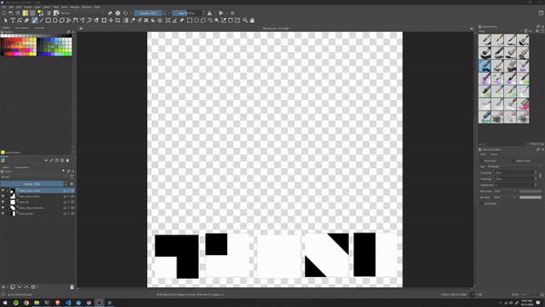

# Krita TileMaps
Python plugin for Krita to help with creating tilemaps & transparency masks.

# Getting Started:
1. Add `tilemaptool.desktop` and the whole `tilemaptool/` folder to your `pykrita` folder (find your krita install path [here](https://docs.krita.org/en/reference_manual/resource_management.html#resource-management)).

1. In Krita, create a new document of any size, tested with 1024x1024 and 2500x2800 (document does not need to be square).

1. Import/create 5 tiles, each on their own layer. They should be named:
  - mask_outer_corner
  - mask_edge_connector
  - mask_inner_corner
  - mask_border
  - mask_fill

4. **Note**: Tiles should be square. This plugin rotates the clones, so the tilemap will have gaps if the height x width is not the same. If you want to use rectangular tiles, you can start with square tiles then manually stretch the tilemap after it's generated.

1. Before generating the tilemap, move the layers to the location you'd like them to be in while you edit. Once the clones are created, the clones will move with your source layers.
1. Go to Tools -> Scripts -> Generate TileMap.
1. Make changes to your original layers and watch them be reflected in the generated tilemap.
1. When you're done editing the tiles, you can merge the clone group into one layer and then export that layer as an image. I use it to create transparency masks that can be applied to other textures created in Krita.
  
# Uses:
- While this plugin can be used to create actual tilemaps, it would only work if the input tiles are symmetrical.
- It is better used as a workflow booster for creating transparency masks, by giving you an instant feedback loop while you edit the mask. Once satisfied with the initial cloned changes, you can merge the clones, then make non-symmetrical changes afterwards.

# Notes
- This tilemap is intended to be used to dual-grid tilemaps. See the resources below for more information on dual-grid tilemaps.
- Default masks are included in the `assets/masks/default/` folder. They are 256x256 pixels, but you can scale them up or down to your liking or create your own.

# Future Work
- A better way to specify the tile layers than hardcoded names.

# Resources:
- Video by jess:codes about dual-grid tilemaps https://www.youtube.com/watch?v=jEWFSv3ivTg&t=1s